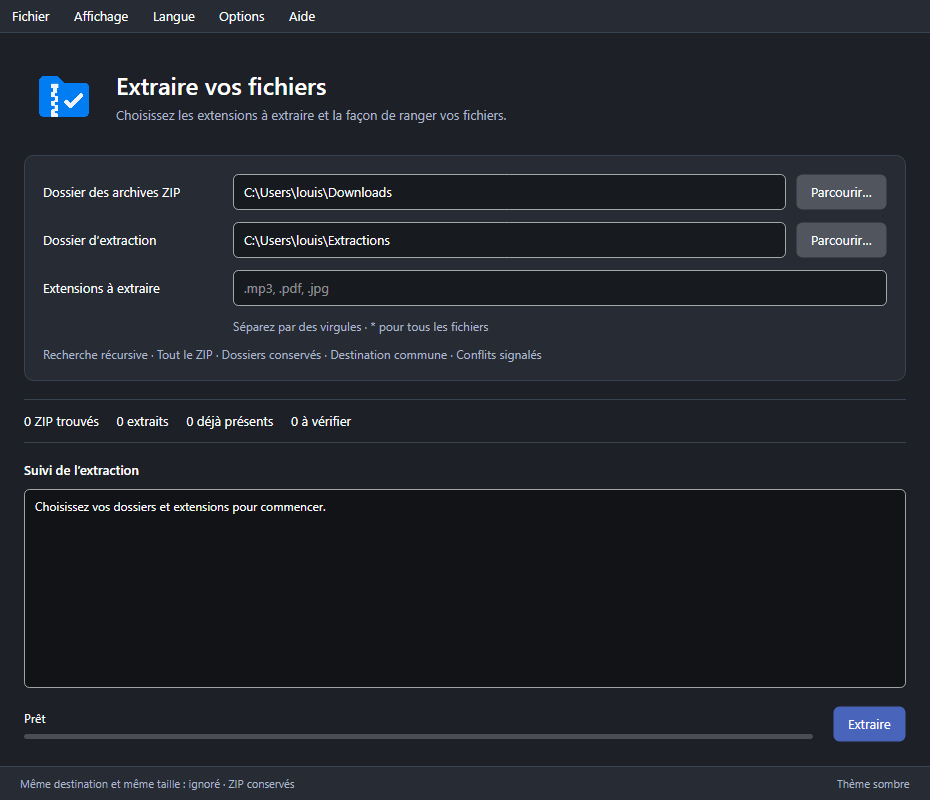

# ZIP Select

[English documentation](docs/README.en.md)

Un utilitaire pour extraire les fichiers de votre choix depuis plusieurs archives ZIP. Interface Avalonia, thèmes clair et sombre, Windows x64 et Linux x64.

**Windows a été testé et utilisé. Linux reste expérimental : le paquet est compilé, mais n’a pas été testé sur un bureau Linux.** macOS n’est pas pris en charge.



## Utiliser l’application

Les exécutables se distribuent dans les **Releases GitHub**, séparément du code source. Les paquets incluent .NET : pas de SDK à installer pour les utiliser.

- Windows : décompresser le paquet et ouvrir `ZIP-Select.exe`. Dans ce dossier de développement, `Lancer.cmd` lance l’application publiée dans `dist/win-x64/`.
- Linux : décompresser le `.tar.gz`, puis lancer `./ZIP-Select` (au besoin `chmod +x ZIP-Select`). La cible est une distribution avec glibc et un bureau X11 ou XWayland, avec Fontconfig et les bibliothèques graphiques usuelles. Alpine/musl n’est pas ciblé.

Choisissez le **dossier des archives ZIP**, le **dossier d’extraction**, puis les extensions à extraire : `.mp3, .pdf`, ou `*` pour tous les fichiers. Cliquez sur **Extraire**.

Depuis la **1.0.1**, le menu **Langue → Français / English** change la langue sans redémarrer et conserve votre choix. Le changement est disponible hors extraction. Les anciens journaux restent dans leur langue d’origine ; les messages provenant du système peuvent suivre la langue du système.

Dans **Options**, choisissez la recherche dans les sous-dossiers, les fichiers à prendre dans le ZIP, la conservation de leur arborescence, un dossier séparé par archive et le renommage des conflits. L’exemple de chemin est une illustration des réglages, pas un aperçu calculé du contenu des archives.

Les archives sont conservées et aucun fichier existant n’est écrasé. Un fichier de même destination et même taille est ignoré, **sans comparaison de son contenu**. L’arrêt conserve les fichiers terminés ; une nouvelle extraction reprend avec ces mêmes règles. Les dossiers sans fichier correspondant ne sont pas créés.

## Développer

Prérequis : SDK **.NET 10**. Depuis la racine du projet :

```powershell
./scripts/Build.ps1 -Action Test
./scripts/Build.ps1 -Action Build
./scripts/Package.ps1 -Runtime win-x64
./scripts/Package.ps1 -Runtime linux-x64
```

Sans PowerShell, pour développer sous Linux :

```sh
dotnet restore tests/ZipSelect.Tests.csproj --configfile NuGet.Config
dotnet run --project tests/ZipSelect.Tests.csproj --no-restore
dotnet run --project src/Desktop/ZipSelect.Desktop.csproj
```

Les tests vérifient le moteur, les options, les préférences et une extraction depuis l’interface sans écran. Les captures sont écrites dans `artifacts/tests/`. Les sélecteurs de dossiers natifs et l’intégration au bureau nécessitent une validation manuelle.

## Organisation

```text
src/Core/        Moteur d’extraction indépendant de l’interface
src/Desktop/     Fenêtres Avalonia et préférences
tests/           Tests du moteur et de l’interface
scripts/         Compilation, tests et paquets distribuables
assets/branding/ Logo retenu et provenance IA
docs/            Captures et guide de publication
.github/         Compilation Windows/Linux et Releases en brouillon
VERSION          Numéro de version commun au programme et aux paquets
```

`dist/`, `artifacts/`, `bin/`, `obj/`, `.tools/` et `.backups/` sont locaux et ignorés par Git. `.tools/` peut contenir le SDK local de développement. `.backups/` conserve notamment l’ancienne version WPF ; ce dossier n’est pas nécessaire pour compiler ou distribuer ZIP Select.

Les préférences existantes restent compatibles : `ZipSelect-Avalonia/settings.json` dans le dossier local des données utilisateur (.NET `LocalApplicationData`). Le nom historique de ce dossier est conservé pour ne pas perdre les réglages.

Le [logo](assets/branding/logo.png) a été **généré par IA avec OpenAI image_gen**. Le [prompt et la provenance](assets/branding/Generation.md) sont conservés, avec une attribution dans le code. Le logo est intégré à la fenêtre et à l’icône de l’application. `logo.ico` est une conversion multirésolution du PNG pour Windows.

Voir [le guide de publication GitHub](docs/Publication.md).
