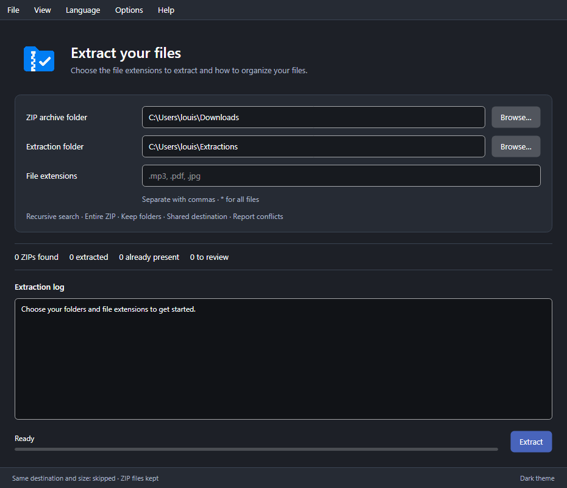

# ZIP Select

[Français](../README.md) · [Downloads](https://github.com/PommeSauce0/zip-select/releases)

Extract selected file types from multiple ZIP archives. Available in French and English, with light and dark themes.



## Usage

On Windows, download and run the `.exe` from Releases. No SDK required. A ZIP is also available.

1. Choose your ZIP archive folder and extraction folder.
2. Enter extensions (`.mp3, .pdf`) or `*` to extract everything.
3. Adjust the options, then click **Extract**.

Options let you search subfolders, keep internal folders, create a folder per ZIP and rename conflicts. Choose **Langue → English** to switch languages.

Existing files are never overwritten. Same destination and size: skipped without comparing contents. ZIP archives are kept.

**Windows x64 tested. Linux x64 experimental, not tested on a Linux desktop.** On Linux: `chmod +x ZIP-Select`, then `./ZIP-Select`; glibc and an X11/XWayland desktop are required.

## Build

With the .NET 10 SDK and PowerShell, from the repository root:

```powershell
./scripts/Build.ps1 -Action Test
./scripts/Package.ps1 -Runtime win-x64
```

The package is created in `dist/packages/`. Use `linux-x64` for Linux.

[Changelog](../CHANGELOG.md) · [Logo generated with AI using OpenAI image_gen](../assets/branding/Generation.md)
